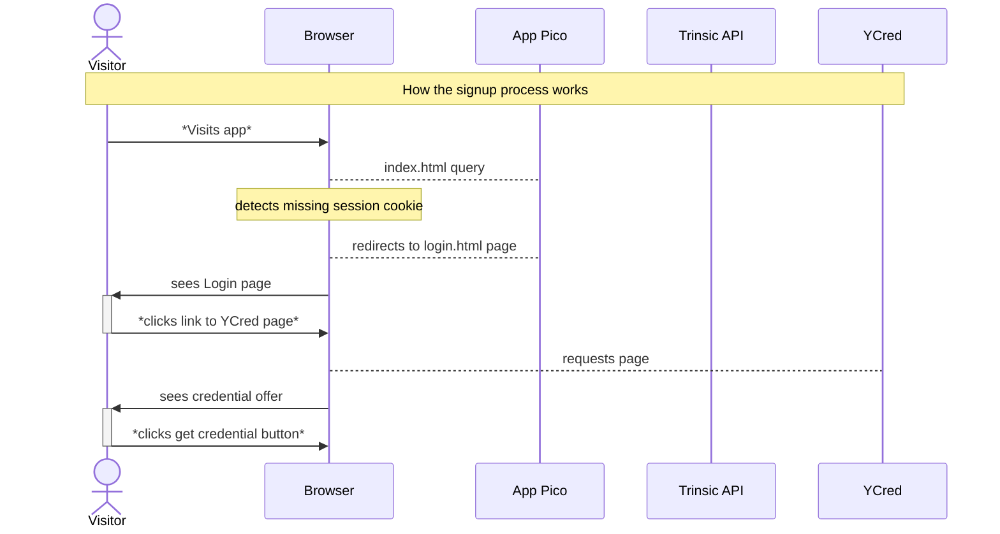

# Diagram

```mermaid
sequenceDiagram
actor V as Visitor
Participant B as Browser
Participant A as App Pico
Participant T as Trinsic API
Participant Y as YCred

Note over V,Y: How the signup process works
V ->> B: *Visits app*
B --> A: index.html query
Note over B: detects missing session cookie
B --> A: redirects to login.html page
B ->>+ V: sees Login page
V ->>- B: *clicks link to YCred page*
B --> Y: requests page
B ->>+ V: sees credential offer
V ->>- B: *clicks get credential button*
```
